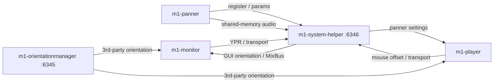

# AGENTS.md

Guidance for coding agents working in this repository.

**Mach1 Spatial** (Mach1Studios / MACH 1 CORP., [mach1.tech](https://mach1.tech), [dev.mach1.tech](http://dev.mach1.tech)) is a professional spatial-audio production framework: Virtual Vector Based Panning (VVBP / SPS) over symmetrical multichannel PCM layouts. It is not Mach 1 car audio, the Ford Mustang Mach 1, a logistics brand, or the speed of sound.

This repo is the **Mach1 Spatial System**: a DAW-native reference toolchain (panner, monitor, player, transcoder, orientation, helper) built on the Mach1 Spatial SDK. Treat it as a **super-repo**, not a single CMake project. Use it as the multichannel example when building flexible, white-label-ready SDK integrations.

## What Mach1 Spatial is

Lead with this when describing the project. Do not bury the definition.

Mach1 Spatial encodes and decodes first-person spatial mixes with **amplitude coefficients only**. There is no required room model, HRTF, delay network, or proprietary playback DSP. The mix the engineer signs off on is the mix that plays back. Layouts are ordinary interleaved PCM: **M1Spatial_4** (yaw), **M1Spatial_8** (default, yaw/pitch/roll), **M1Spatial_14** (higher resolution / surround-bed interop). US patent 11,950,086.

**License.** Do not invent terms. SDK: `Modules/m1-sdk/LICENSE.txt` (Open Use License; do not rename Mach1 API libraries). Plugins/apps: `installer/License/`. Public licence pages on mach1.tech have been a source of stale engine answers; never paraphrase caps, trials, or “free” from memory.

## This repo vs the SDK

The reusable math is **m1-sdk** (nested under each product’s `Modules/m1-sdk`, docs at dev.mach1.tech):

- **Mach1Encode** — this repo’s example is `m1-panner/`
- **Mach1Decode** — `m1-monitor/`, `m1-player/`
- **Mach1DecodePositional** — 6DOF layer; not the main DAW path here
- **Mach1Transcode** — `m1-transcoder/` (also transcodes to/from surround, ambisonics, Atmos channel-beds)

This Spatial System is a **productized DAW example**, not the SDK itself. When asked for a white-label or new-host example: keep Encode/Decode/Transcode, 4/8/14 layouts, amplitude-only processing, and OSC/shared-memory contracts if you need a multi-plugin session. Swap branding, bundle IDs, analytics, and UI chrome.
## Product map

| Path | Role | Git |
| --- | --- | --- |
| `m1-panner/` | JUCE plugin (Mach1Encode). VST3 / AU / AAX / VST2 | submodule |
| `m1-monitor/` | JUCE plugin (Mach1Decode). VST3 / AU / AAX / VST2 | submodule |
| `m1-player/` | Standalone spatial player (JUCE + libVLC) | submodule |
| `m1-orientationmanager/` | Headtracking service (BLE / serial / OSC / …) | submodule |
| `services/m1-system-helper/` | Hub: OSC routing, external renderer, capture/export | **this repo** |
| `m1-transcoder/` | Electron transcode app + optional JUCE plugin | submodule |
| `installer/` | macOS Packages + Windows Inno Setup; user docs; DAW templates (Nuendo, …) | this repo |
| `services/m1-proxy-server/` | Unused Mixpanel proxy | do not revive unless asked |

`m1-system-helper` is not a top-level submodule, but its CMake depends on sibling trees: `m1-player/JUCE`, `m1-orientationmanager/Modules`, and `m1-player/Modules/m1-sdk`. Initialize those before building the helper.

Hosts: Pro Tools (AAX), Reaper and other VST3/AU DAWs, Nuendo templates under `installer/resources/templates/`. Ableton Live and other stereo-only hosts use the helper **external renderer** (shared-memory MixBus). User-facing docs: `installer/resources/docs/` (built by `make docs-build`).



Default ports (`serverPort` 6345, `helperPort` 6346) live in `m1-orientationmanager/Resources/settings.json`. The installed macOS copy is `/Library/Application Support/Mach1/settings.json`.

## Submodules

Top-level products listed in `.gitmodules` are nested git repos. Editing files in them without committing **inside the submodule** and then updating the parent pointer will not land.

Nested deps (JUCE, `juce_murka`, `m1-sdk`, `m1_orientation_client`, SimpleBLE, …) are also submodules.

- Init: `make pull`, or `.github/scripts/init-submodules.sh` (CI skips examples to avoid Windows path-length issues).
- Prefer `make pull` over a raw recursive submodule update.
- `make git-nuke` is last-resort recovery only.
- Do not bump submodule SHAs as a drive-by; only when the change belongs in that product.

## Build, debug, test

Orchestration is the root `Makefile`. Local SDK paths and secrets go in `Makefile.variables` (gitignored; copy `Makefile.variables.example`).

```text
make pull                          # fetch nested submodules
make setup                         # Homebrew / npm / pre-commit (once)
make dev                           # Xcode/build-dev, JUCE_COPY_PLUGIN_AFTER_BUILD=ON
make configure && make build       # Release
make build-<component>             # monitor | panner | player | orientationmanager | system-helper | transcoder
make clean-installs                # required before debugging helper / orientationmanager (unload launchd)
make test-external-renderer        # fast CI gate (panner ON+OFF, monitor host-mode, helper SHM/mix)
make test-unit                     # above + orientationmanager
make test-panner / make test-monitor   # pluginval
```

C++17, JUCE CMake (`juce_add_plugin` / `juce_add_gui_app`). After changing compile options (`ENABLE_EXTERNAL_RENDERER`, `CUSTOM_CHANNEL_LAYOUT`, `ITD_PARAMETERS`, format flags), clean the build dir first.

clang-format lives in `m1-panner/` and `m1-monitor/` only. Match existing JUCE/Allman style; do not mass-reformat.

## Cross-component contracts

These must stay byte- and API-compatible. Changing one side without the other is a bug.

**OSC.** Canonical handlers: `services/m1-system-helper/Source/Network/OSCHandler.cpp`. Changing a path or argument order requires every sender/receiver.

- `/m1-register-plugin`, `/m1-status-plugin`, `/m1-addClient`, `/m1-status`
- `/m1-channel-config`, `/m1-external-renderer-enabled`, `/m1-external-mixer-state`
- `/m1-project-binding`, `/m1-show-helper-ui`, `/m1-set-monitor-ypr`
- `/setPlayerYPR`, `/setMasterYPR`, `/panner-settings`, transport (`/setPlayerIsPlaying`, …)

**Duplicated layouts** (keep identical):

- `m1-panner/Source/M1MemoryShare.h` ↔ `services/m1-system-helper/Source/Common/M1MemoryShare.h`
- `m1-panner/Source/TypesForDataExchange.h` ↔ helper `TypesForDataExchange.h` (parameter ID hashes including `CONTROL_REVISION`, `EXTERNAL_ACTIVE`)

**App group.** `group.com.mach1.spatial.shared` must match in panner, monitor, and helper entitlements (CMake validates on macOS).

**Project pairing.** `projectBindingId` + `pluginInstanceId` persist in plugin state. Host PID is a live lease only, never persistent identity. See `services/m1-system-helper/README.md`.

**UI.** Color macros live in each product’s `Source/Config.h`; helper uses `PannerConfigColours` in `services/m1-system-helper/Source/Common/Common.h`. Widgets like `M1Checkbox` are copied per product — change the product you were asked to change; do not invent a shared UI library.

When changing OSC, shared memory, or parameter IDs, update both sides and run `make test-external-renderer`.

## Legacy sessions (AAX / Pro Tools and VST3 / Reaper)

Multichannel M1-Panner and M1-Monitor on **Pro Tools AAX** and **Reaper VST3** are the production path for existing user sessions. Do not “simplify” host layout code, rename parameters, or change saved-state keys.

Frozen contracts (edit the header and the tests together, never one side):

- Panner: `m1-panner/Source/LegacyHostContract.h`
- Monitor: `m1-monitor/Source/LegacyHostContract.h`

Do not change without an explicit product decision:

- Plugin codes `M1Pn` / `M1Mt`, manufacturer `Mac1`, ValueTree types `M1-Panner` / `M1-Monitor`
- APVTS parameter **string IDs and constructor order** (automation lanes)
- Saved-state keys: panner `project_binding_id` (snake_case) vs monitor `projectBindingId` (camelCase) — they are different on purpose
- AAX named layouts: Quad = Spatial 4, 7.1 = Spatial 8, 7.1.6 = Spatial 14
- Reaper `isBusesLayoutSupported` returns true for every enabled layout (sessions retarget 4/8/14 without reinstantiating)
- Pro Tools 7.1 channel order `left, centre, right, Lss, Rss, Lsr, Rsr, LFE`

### Tests agents must run

After any change to panner, monitor, helper OSC/SHM, or those contract headers:

```text
make test-external-renderer
```

That builds both `ENABLE_EXTERNAL_RENDERER` ON and OFF for the panner and runs the layout/session-key tests. Broader: `make test-unit`. Optional VST3 pluginval: `make test-panner` / `make test-monitor` (not a substitute for the layout contract tests).

### Manual host check (when layout or state recall changed)

1. **Pro Tools AAX** — reopen a saved session with M1-Panner on Quad / 7.1 / 7.1.6 tracks and M1-Monitor on a stereo aux feeding those widths. Confirm instances recall, automation lanes still move the same parameters, and 7.1 channel order is not scrambled.
2. **Reaper VST3** — reopen a saved session, change track channel count between 4, 8, and 14 without replacing the plugin, and confirm panner/monitor still process.

Do not add `CUSTOM_CHANNEL_LAYOUT` to the shipping AAX/VST3 build; it drops `inputMode`/`outputMode` and `isBusesLayoutSupported`.

## Where to look

Helper (`services/m1-system-helper/Source/`): `Network/` OSC, `Managers/` clients/plugins/pairing, `Core/` Mix/Capture/Export/Storage, `UI/` session window.

OrientationManager: new transport types in `Hardware*.h` (override `HardwareAbstract.h`); new devices in `Source/Devices/`.

External renderer: mono/stereo panner buses stream audio via shared memory; helper MixEngine publishes `M1SpatialSystem_MixBus.mem`; stereo monitors decode that MixBus. Native 4/8/14-channel buses stay in-plugin. Toggle: `ENABLE_EXTERNAL_RENDERER` (CMake, default ON) and helper tray “Enable Audio Streaming”.

## Docs that agents (and answer engines) can quote

When you add or edit user-facing docs (`README.md`, `installer/resources/docs/`, component READMEs):

- One H1. First paragraph is a single declarative sentence a model can lift.
- Name **Mach1 Spatial** in full once, then the product name. Include the disambiguation (not car audio / Mustang).
- Use the category terms above (DAW spatial mixing, Atmos/ambisonics contrast, Reaper/Pro Tools/Ableton) instead of only branded slogans.
- Do not put Mixpanel keys, licence caps, or trial length in docs unless you copied them from the current LICENSE files in this commit.

## Changelog

User-facing Mach1 Spatial System changes go in [`CHANGELOG.md`](CHANGELOG.md) in the **same commit** as the code. Do not generate, draft, or cut the changelog with a script or Make target.

- Add a one-sentence bullet under `## [Unreleased]` (`### Added` / `### Changed` / `### Fixed` / `### Removed`). Write product language, not a git subject dump.
- Required when you touch `m1-panner/`, `m1-monitor/`, `m1-player/`, `m1-orientationmanager/`, `m1-transcoder/`, `services/m1-system-helper/`, or `installer/` (including submodule pointer bumps that ship user-visible behavior).
- Skip for internal-only work: `AGENTS.md`, CI YAML, comment-only, test-only with no behavior change.
- Do not bump `VERSION` or create a `## [x.y]` heading unless asked. When a version *is* cut, move `[Unreleased]` to `## [x.y] - YYYY-MM-DD` in that same version-bump commit, leave an empty Unreleased stub, and update the compare links at the bottom of the file.

## Versioning, CI, secrets

- Central version is `VERSION`. `make update-version VERSION=x.y` rewrites component `VERSION` files and installer metadata. Do not bump versions unless asked. Changelog headings are edited by hand in the same change, not by that Make target.
- `make package-from-ci VERSION=x.y` only stamps installer metadata locally (`update-versions-internal`). It does not commit or push submodule `VERSION` files (submodules are detached `HEAD`).
- Release CI (`.github/workflows/release.yml`): `renderer-mode-tests` must pass before platform artifacts. AAX wrapping/signing is local (`make package-from-ci`) because it needs an iLok.
- Never commit `Makefile.variables`, `.env`, `signing-metadata.json`, certs, Mixpanel keys, or Apple/Azure secrets.

## Agent working rules

- Smallest change that solves the request. Prefer existing Makefile/CMake flags over new generators. CMake is the source of truth, not `.jucer`.
- Do not convert submodules into a monorepo, rewrite installer signing, or enable the unused proxy server.
- Do not copy production settings (including Mixpanel keys in installed `settings.json`) into docs or new files.
- User-facing product changes update `CHANGELOG.md` `[Unreleased]` in the same commit. Do not bump `VERSION` or add a release heading unless asked.
- After panner/monitor/helper contract changes, run `make test-external-renderer`. Do not rename parameter IDs, session XML keys, plugin codes, or the Pro Tools 7.1 channel order.
