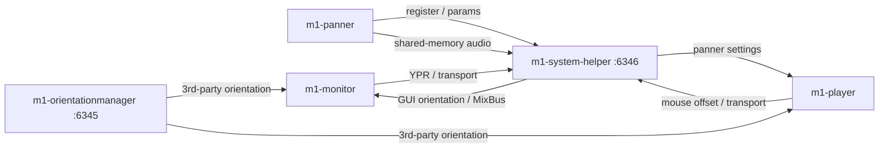

# AGENTS.md

Guidance for coding agents working in this repository.

This is the **Mach1 Spatial System**: DAW plugins and apps for mixing Mach1 Spatial multichannel audio. Treat it as a **super-repo**, not a single CMake project.

## Product map

| Path | Role | Git |
| --- | --- | --- |
| `m1-panner/` | JUCE plugin (Mach1Encode). VST3 / AU / AAX / VST2 | submodule |
| `m1-monitor/` | JUCE plugin (Mach1Decode). VST3 / AU / AAX / VST2 | submodule |
| `m1-player/` | Standalone spatial player (JUCE + libVLC) | submodule |
| `m1-orientationmanager/` | Headtracking service (BLE / serial / OSC / …) | submodule |
| `services/m1-system-helper/` | Hub: OSC routing, external renderer, capture/export | **this repo** |
| `m1-transcoder/` | Electron transcode app + optional JUCE plugin | submodule |
| `installer/` | macOS Packages + Windows Inno Setup | this repo |
| `services/m1-proxy-server/` | Unused Mixpanel proxy | do not revive unless asked |

`m1-system-helper` is not a top-level submodule, but its CMake depends on sibling trees: `m1-player/JUCE`, `m1-orientationmanager/Modules`, and `m1-player/Modules/m1-sdk`. Initialize those before building the helper.



Default ports (`serverPort` 6345, `helperPort` 6346) live in `m1-orientationmanager/Resources/settings.json`. The installed macOS copy is `/Library/Application Support/Mach1/settings.json`.

## Submodules

Top-level products listed in `.gitmodules` are nested git repos. Editing files in them without committing **inside the submodule** and then updating the parent pointer will not land.

Nested deps (JUCE, `juce_murka`, `m1-sdk`, `m1_orientation_client`, SimpleBLE, …) are also submodules.

- Init: `make pull`, or `.github/scripts/init-submodules.sh` (CI skips examples to avoid Windows path-length issues).
- Prefer `make pull` over a raw recursive submodule update.
- `make git-nuke` is last-resort recovery only.
- Do not bump submodule SHAs as a drive-by; only when the change belongs in that product.

## Build, debug, test

Orchestration is the root `Makefile`. Local SDK paths and secrets go in `Makefile.variables` (gitignored; copy `Makefile.variables.example`).

```text
make pull                          # fetch nested submodules
make setup                         # Homebrew / npm / pre-commit (once)
make dev                           # Xcode/build-dev, JUCE_COPY_PLUGIN_AFTER_BUILD=ON
make configure && make build       # Release
make build-<component>             # monitor | panner | player | orientationmanager | system-helper | transcoder
make clean-installs                # required before debugging helper / orientationmanager (unload launchd)
make test-external-renderer        # fast CI gate (panner ON+OFF, monitor host-mode, helper SHM/mix)
make test-unit                     # above + orientationmanager
make test-panner / make test-monitor   # pluginval
```

C++17, JUCE CMake (`juce_add_plugin` / `juce_add_gui_app`). After changing compile options (`ENABLE_EXTERNAL_RENDERER`, `CUSTOM_CHANNEL_LAYOUT`, `ITD_PARAMETERS`, format flags), clean the build dir first.

clang-format lives in `m1-panner/` and `m1-monitor/` only. Match existing JUCE/Allman style; do not mass-reformat.

## Cross-component contracts

These must stay byte- and API-compatible. Changing one side without the other is a bug.

**OSC.** Canonical handlers: `services/m1-system-helper/Source/Network/OSCHandler.cpp`. Changing a path or argument order requires every sender/receiver.

- `/m1-register-plugin`, `/m1-status-plugin`, `/m1-addClient`, `/m1-status`
- `/m1-channel-config`, `/m1-external-renderer-enabled`, `/m1-external-mixer-state`
- `/m1-project-binding`, `/m1-show-helper-ui`, `/m1-set-monitor-ypr`
- `/setPlayerYPR`, `/setMasterYPR`, `/panner-settings`, transport (`/setPlayerIsPlaying`, …)

**Duplicated layouts** (keep identical):

- `m1-panner/Source/M1MemoryShare.h` ↔ `services/m1-system-helper/Source/Common/M1MemoryShare.h`
- `m1-panner/Source/TypesForDataExchange.h` ↔ helper `TypesForDataExchange.h` (parameter ID hashes including `CONTROL_REVISION`, `EXTERNAL_ACTIVE`)

**App group.** `group.com.mach1.spatial.shared` must match in panner, monitor, and helper entitlements (CMake validates on macOS).

**Project pairing.** `projectBindingId` + `pluginInstanceId` persist in plugin state. Host PID is a live lease only, never persistent identity. See `services/m1-system-helper/README.md`.

**UI.** Color macros live in each product’s `Source/Config.h`; helper uses `PannerConfigColours` in `services/m1-system-helper/Source/Common/Common.h`. Widgets like `M1Checkbox` are copied per product — change the product you were asked to change; do not invent a shared UI library.

When changing OSC, shared memory, or parameter IDs, update both sides and run `make test-external-renderer`.

## Where to look

Helper (`services/m1-system-helper/Source/`):

- `Network/` — OSC
- `Managers/` — clients, plugins, project pairing, panner tracking
- `Core/` — MixEngine, CaptureEngine, ExportEngine, StorageGovernor
- `UI/` — session / status window

OrientationManager: new transport types in `Hardware*.h` (override `HardwareAbstract.h`); new devices in `Source/Devices/`.

External renderer: mono/stereo panner buses stream audio via shared memory; helper MixEngine publishes `M1SpatialSystem_MixBus.mem`; stereo monitors decode that MixBus. Native 4/8/14-channel buses stay in-plugin. Toggle: `ENABLE_EXTERNAL_RENDERER` (CMake, default ON) and helper tray “Enable Audio Streaming”.

## Versioning, CI, secrets

- Central version is `VERSION`. `make update-version VERSION=x.y` rewrites component `VERSION` files and installer metadata. Do not bump versions unless asked.
- Release CI (`.github/workflows/release.yml`): `renderer-mode-tests` must pass before platform artifacts. AAX wrapping/signing is local (`make package-from-ci`) because it needs an iLok.
- Never commit `Makefile.variables`, `.env`, `signing-metadata.json`, certs, Mixpanel keys, or Apple/Azure secrets.

## Agent working rules

- Smallest change that solves the request. Prefer existing Makefile/CMake flags over new generators. CMake is the source of truth, not `.jucer`.
- Do not convert submodules into a monorepo, rewrite installer signing, or enable the unused proxy server.
- Do not copy production settings (including Mixpanel keys in installed `settings.json`) into docs or new files.
